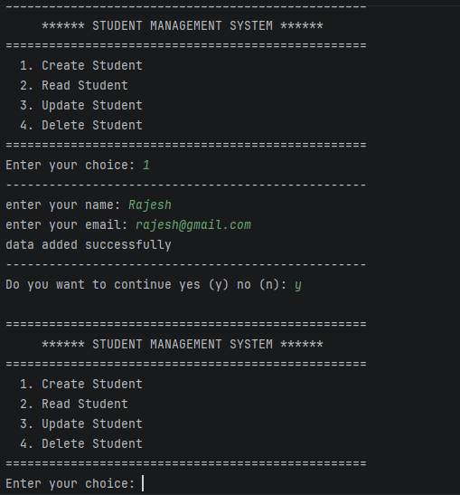
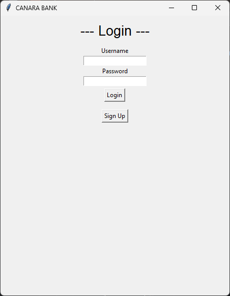
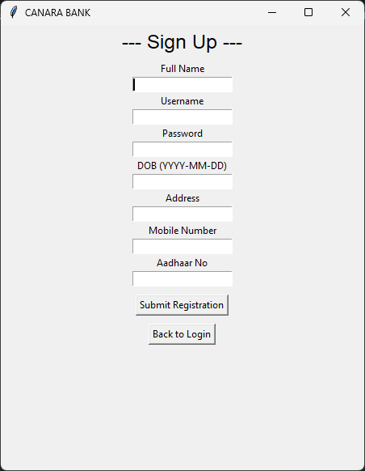
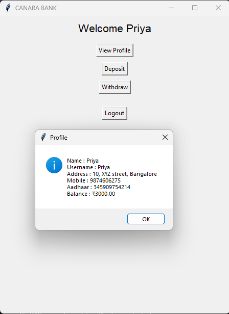
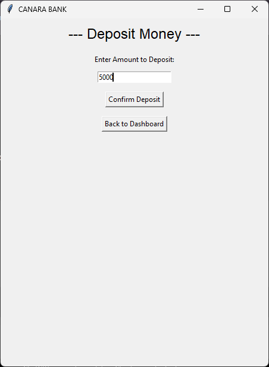
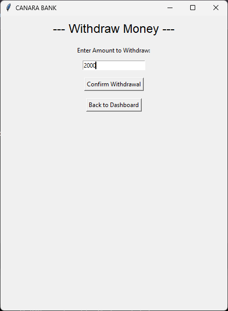

# Python Projects Portfolio

This repository contains Python projects developed for learning and portfolio purposes.

## Projects

### GST Matching System

* Compares Purchase Register with GSTR-2B
* Identifies matched and unmatched invoices
* Uses Pandas and Excel

### Credit Risk Analysis

* Analyzes customer credit risk
* Generates risk classifications

### CRUD Application

* Create, Read, Update, Delete operations

### Application Screen

### GUI Bank System

* Banking application using Python GUI

## GUI Bank System

### Login Page

### Sign Up Page

### Dashboard

### Deposit Money

### Withdraw Money

### Inventory Ageing Analysis

* Calculates ageing of inventory

### Automated Invoice Generator & Ledger

* Generates invoices and maintains ledgers

### Small Shop Management System

* Product management and sales tracking

## Technologies Used

* Python
* Pandas
* Excel
* MySQL
* Tkinter
